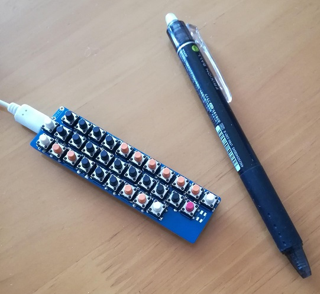

# tact31_keyboard

A 30% keyboard with tactile switches

Tact31 Keyboard は、タクトスイッチを用いた30%キーボードです。[Nomu30](https://keys.recompile.net/projects/nomu30/)というキーボードにインスパイアされました。ファームウエアに[QMK](https://qmk.fm/)を利用しています。

- [キーマップ](http://www.keyboard-layout-editor.com/#/gists/11d8e3943e98f012d6dd6bc9da6640ee)
- [Build Guide](doc/build.md)