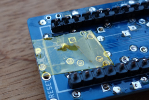

# tact31_keyboard build guide

## 部品リスト

|品名|数量|入手先の例|
|----|----|-------|
|tact31_keyboard 基板|1枚| [お問い合わせください](mailto:matobaa+tact31@gmail.com)
|タクタイルスイッチ|31個|[秋月電子 100個セット 700円](http://akizukidenshi.com/catalog/g/gP-01282/)
|カソードコモンSMDダイオード<br>(またはSMDダイオード|16個<br>31個|[秋月電子 SMDダイオード 2素子入り 20個 100円](http://akizukidenshi.com/catalog/g/gI-14250/)<br>[秋月電子 SMDダイオード 40個 100円](http://akizukidenshi.com/catalog/g/gI-07084/))
|Pro Micro |1個| [スイッチサイエンス 1980円](https://www.switch-science.com/catalog/3914/)<br>[Aliexpress 400円くらい](https://ja.aliexpress.com/w/wholesale-pro-micro-atmega32u4.html) microUSBコネクタつき、5v品を
|(Pro Microに同梱されていなければ)<br>ピンヘッダ 2mm厚|12pin ×2|[秋月電子 ピンヘッダ 1x40 35円](http://akizukidenshi.com/catalog/g/gC-00167/) 
|||||

## 組み立て手順

<a href="pwb.jpg"></a>
### 基板の確認

組み立ての前に、基板の表裏を確認します。基板は横長で、小さな白い枠が描かれていて右上にBSと書かれている面が表面、基板の半分位の大きな白い枠が描かれている方が裏面です。

### ファームウェアの準備

デフォルトのファームウェアである [tact31_default.hex](../../../releases/) が配布されています。ビルド環境をつくるのが難しい方はこちらを利用してください。

ソースから作成する場合、Linux環境がおすすめです。Windows環境の方は [Gooble Cloud Shell](https://ssh.cloud.google.com/) などを利用するとお手軽です。

1. ソースとサブモジュールを clone します。
    ```
    $ git clone https://github.com/matobaa/tact31_keyboard.git  --recursive
    $ cd tact31_keyboard/firmware/
    ```
1. クロスコンパイル環境を整えます (すこし時間がかかります)。
    ```
    $ ./qmk_firmware/util/qmk_install.sh
    ```
1. make します。
    ```
    $ make
    $ ls -l tact31_default.hex
    ```

### Pro Micro の準備

組み立ての前に、Pro Microにファームウェアを書き込んで動作確認をしてください。詳細な手順についてはサリチル酸さんのサイトを参考にしてください。

- [（初心者編）自作キーボードにファームウェアを書き込む](https://salicylic-acid3.hatenablog.com/entry/qmk-toolbox)


### ダイオードのはんだ付け

基板の裏面にある四角いパッドに表面実装ダイオードをはんだ付けします。取り付けには向きがあります。

2素子入りSMDダイオードを使う場合、図の下の左右のパッドに2本の足が、上の中央のパッドに1本の足がくるように置いてはんだ付けします。上の3つのパッドはつながってしまっても問題ありません。全部で16か所あります。

1素子SMDダイオードを使う場合、図の右と左に一つずつ、パッドが3つ並んでいる側に線がくるように縦にはんだ付けします。全部で31か所あります。ncと書いてあるところは不要です。

取りつけ終わったらテスターで確認します。テスターをダイオードチェックモード(または導通チェックモード)に合わせ、R0と書かれた四角いランドに黒いテストリードを当てた状態で、最下段の四角いランド(11か所)に赤いテストリードを順に当ててチェックしてください。同様に、R1に黒リードを当てた状態で、中段の四角いランド(10か所)に赤リードを順に当ててチェック、R2に黒リードを当てた状態で、上段の四角いランド(9か所)と中段右端の四角いランド(1か所)に赤リードを順に当ててチェックします。


### ピンヘッダのはんだ付け


スイッチがデコボコしないよう、ピンヘッダはツライチで取り付ける必要があります。ピンヘッダのすべてのピンを、長さ1.6mm未満になるようにニッパでカットします。ピンヘッダは硬いです。12pin×2の両方で48か所、怪我をしないよう、落ち着いて作業してください。

カットしたら、ピンヘッダを裏から取り付け、表からはんだ付けします。Xの左上、Vの左上の2カ所はランドが近接していますが、つながってしまっても問題ありません。ここではまだ Pro Micro は取り付けません。


### タクトスイッチのはんだ付け

タクトスイッチの足も同様に短く切っておきます。ピンヘッダの間にくる足は2mm程度、特に左端のTABキーのスイッチは1.6mm未満にしないと干渉します。

足をカットしたら、タクトスイッチを表から取り付け、裏からはんだ付けします。足を短くカットしてしまうとはんだづけの際に固定されないため、マスキングテープなどで固定しながら作業してください。

WとAとZ、RとDとC、YとGとB、IとJとM、PとL のランドは近接しています。つながってしまっても問題ありません。

### Pro Micro のはんだ付け


左端のTABキーの裏側はUSBコネクタと接触しますので、絶縁のためにポリイミドテープを貼っておきます。なければセロハンテープや付箋紙でもよいでしょう。はんだづけした足が尖っていると貫通してしまうので丸くしておきましょう。

最後に、チップが載っている面が内側を向くように、Pro Micro をはんだ付けしてください。

組み立ての手順は、以上です。

なお、リセットボタン、TX/RX、表面の右側にあるパッドはオプションです。
